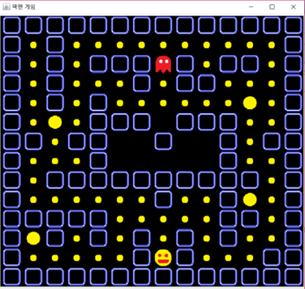
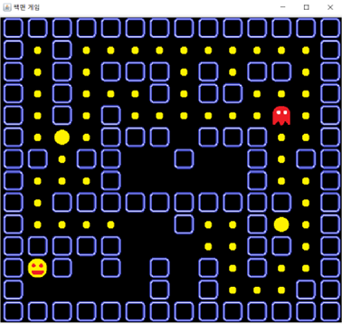
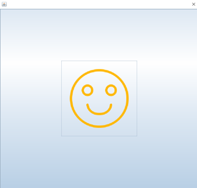
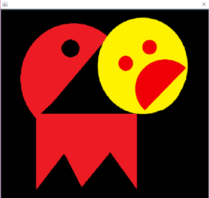

## 🕹️ Pac-Man Game – Java GUI Project

### 📌 Overview  
This project is a simple Pac-Man game implemented in Java as part of a programming course. Initially inspired by my love for games and the difficulty in conceptualizing a customer management system, this game was chosen to explore Java GUI development using AWT and Swing.

### 🛠️ Technologies Used  
- Java (JDK)  
- AWT / Swing GUI Framework  
- Event-driven programming (KeyListener, ActionListener)  
- ImageIcon for object rendering  
- Java Sound API for background music and effects  

### 🎮 Game Features  
- 14×14 tile-based map using `JLabel[][]`  
- Player controls Pac-Man using keyboard arrows  
- Pac-Man eats dots, wins when all are eaten  
- Random-moving enemy: game ends if Pac-Man collides with the enemy  
- Displays different images for victory and defeat  
- Enhanced game experience with sound effects and background music  
- "Big Dot" feature fixed to ensure smooth gameplay  

### 🧩 Development Highlights  
- Implemented random movement logic for enemies using `switch-case` with random integers  
- Designed collision detection between Pac-Man and walls/enemies  
- Enhanced visual and auditory experience using custom icons and sounds  
- Fixed issues from base code (e.g. broken victory screen, immovable Big Dot)  

### 📷 Screenshots  
- Start screen
    
- Pac-Man eating dots
   
- Victory screen ("Succession" object)
      
- Defeat screen ("Fail Icon" object)
  

### 🤔 Reflection  
This project helped me consolidate what I learned throughout the semester. Creating something I personally wanted, not just a practice assignment, gave me a sense of accomplishment. I also recognized areas for improvement, especially in optimizing code length and logic.

### 📚 References  
- [명품 JAVA Programming, 4th edition – Hwang Kitae, Kim Hyosu]  
- Java Sound API: https://micropilot.tistory.com/2414  
- Sample Pac-Man code reference: http://koreaparks.tistory.com/83  
- Java GUI (Swing, AWT) tutorial: https://bskwak.tistory.com/181

