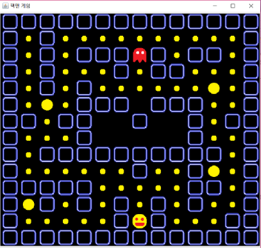
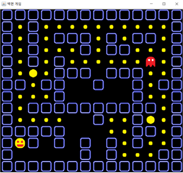
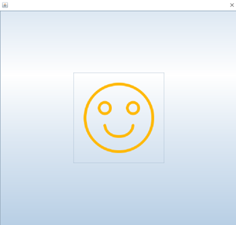
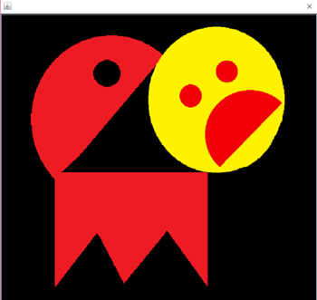

# 👾 팩맨 게임 – Java GUI 프로젝트

이 프로젝트는 Java를 활용해 구현한 간단한 팩맨 게임입니다.  
처음에는 고객 관리 시스템을 구상하는 데 어려움을 느껴,  
게임에 대한 관심을 바탕으로 GUI 개발을 직접 경험해보고자 선택한 과제입니다.

---

## 🛠️ 사용 기술

- Java (JDK)  
- AWT / Swing GUI 프레임워크  
- 이벤트 기반 프로그래밍 (`KeyListener`, `ActionListener`)  
- `ImageIcon`을 활용한 객체 렌더링  
- Java Sound API를 통한 배경음악 및 효과음 구현

---

## 🎮 게임 기능

- `JLabel[][]`을 활용한 14×14 타일 기반 맵  
- 방향키로 팩맨 조작  
- 팩맨이 점을 모두 먹으면 승리  
- 적은 랜덤하게 움직이며, 충돌 시 게임 오버  
- 승리/패배 시 다른 이미지 출력  
- 배경음악 및 효과음으로 몰입도 향상  
- "Big Dot" 기능 오류 수정으로 부드러운 플레이 제공

---

## 🔧 개발 포인트

- `switch-case`와 난수 생성으로 적의 랜덤 이동 구현  
- 벽 및 적과의 충돌 판정 로직 설계  
- 커스텀 아이콘과 사운드를 활용한 시각/청각적 경험 강화  
- 기존 코드의 버그 수정 (예: 승리 화면 미출력, Big Dot 이동 불가 문제 해결)

---

## 📸 게임 화면

### 🟡 시작 화면  

### 🟡 팩맨 플레이 중  

### 🟢 승리 화면 (`Succession` 객체)  

### 🔴 패배 화면 (`Fail Icon` 객체)  

---

## 💭 프로젝트 회고

이번 프로젝트를 통해 한 학기 동안 배운 내용을 직접 적용해볼 수 있었습니다.  
단순한 실습 과제를 넘어서, 내가 직접 만들고 싶은 것을 구현했다는 점에서 큰 성취감을 느꼈습니다.  
특히 코드 최적화와 로직 설계 측면에서 개선할 부분도 많이 발견할 수 있었고,  
GUI 프로그래밍에 대한 자신감도 함께 얻었습니다.

---

## 📚 참고 자료

- 『명품 JAVA Programming 4판』 – 황기태, 김효수  
- [Java Sound API 설명](https://micropilot.tistory.com/2414)  
- [Pac-Man 샘플 코드 참고](http://koreaparks.tistory.com/83)  
- [Java GUI 튜토리얼 (Swing, AWT)](https://bskwak.tistory.com/181)

---

## 🙋‍♂️ 작성자

**박성원 (Seongwon Park)**  
- Java GUI 개발 실습  
- 이벤트 처리 및 이미지/사운드 활용  
- 게임 로직 설계 및 디버깅 경험

---
